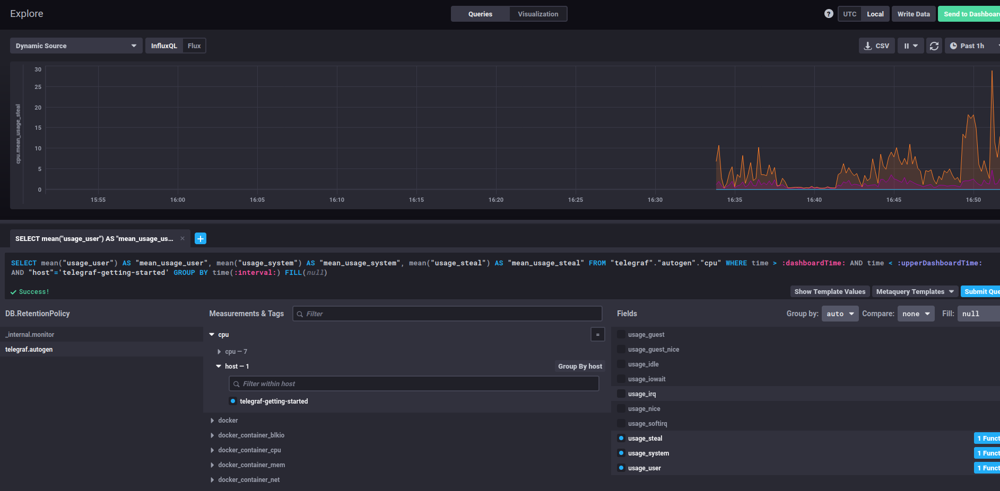
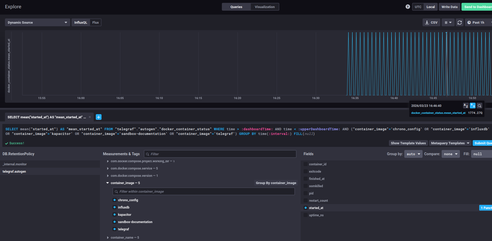

# Домашнее задание к занятию "13.Системы мониторинга"

## Обязательные задания

1. Вас пригласили настроить мониторинг на проект. На онбординге вам рассказали, что проект представляет из себя
   платформу для вычислений с выдачей текстовых отчетов, которые сохраняются на диск. Взаимодействие с платформой
   осуществляется по протоколу http. Также вам отметили, что вычисления загружают ЦПУ. Какой минимальный набор метрик вы
   выведите в мониторинг и почему?
   CPU utilization (%)
   RAM utilization (%)
   Disk space utilization (%)
   Disk IOPS (ops/s)
   Disk latency (ms) - Latency диска (мс): время отклика диска — рост задержки указывает на проблемы с дисковой подсистемой.
   HTTP RPS (req/s)
   HTTP latency (p50, p95, p99, ms) - Latency (мс): время обработки запроса. Важно отслеживать процентили:
    - p50 (медиана) — типичное время ответа;
    - p95 — время ответа для 95% запросов (выявляет «медленные» случаи);
    - p99 — время ответа для 99% запросов (выявляет пики задержек).
      HTTP error rate (4xx+5xx, % или кол‑во)
      Availability (%)
      Health Check status (up/down)

Из того, что не знал, это Latency


#
2. Менеджер продукта посмотрев на ваши метрики сказал, что ему непонятно что такое RAM/inodes/CPUla. Также он сказал,
   что хочет понимать, насколько мы выполняем свои обязанности перед клиентами и какое качество обслуживания. Что вы
   можете ему предложить?
   Для менеджеров делаем отдельный дашборд, который отвечает требования SLO

   | Показатель | Цель (SLO) | Измерение | Бизнес‑ценность |
      |----------|------------|-----------|---------------|
   | Время генерации отчёта | $p95 < 3$ с, $p99 < 10$ с | HTTP latency (p95/p99) | Пользователи не ждут долго |
   | Доступность сервиса | $99{,}9\%$ в месяц | Availability (%) | Минимизация простоев |
   | Успешность операций | $99{,}5\%$ успешных запросов | HTTP error rate | Меньше ошибок для клиентов |
   | Скорость ответа в пиках | $p99 < 15$ с при нагрузке $+50\%$ | HTTP latency + RPS | Стабильность при скачках трафика |
   | Время восстановления после сбоя | $< 5$ мин | Health Check + Availability | Быстрое возвращение к работе |
   | Утилизация CPU | $\leq 80\%$ при штатной нагрузке | CPU utilization (%) | Запас мощности для пиков, предотвращение замедления вычислений |
   | Утилизация RAM | $\leq 75\%$ при штатной нагрузке | RAM utilization (%) | Предотвращение свопинга и сбоев из‑за нехватки памяти |
   | Свободное место на диске | $\geq 20\%$ свободного пространства | Disk space utilization (%) | Гарантия возможности сохранять отчёты, предотвращение ошибок записи |
   | Производительность дисковой подсистемы | Latency $\leq 15$ мс, IOPS $\geq 1000$ | Disk latency (ms) + Disk IOPS (ops/s) | Быстрая запись отчётов и чтение данных для вычислений, отсутствие задержек из‑за диска |


#
3. Вашей DevOps команде в этом году не выделили финансирование на построение системы сбора логов. Разработчики в свою
   очередь хотят видеть все ошибки, которые выдают их приложения. Какое решение вы можете предпринять в этой ситуации,
   чтобы разработчики получали ошибки приложения?
   Я бы сделал так, все логи ERROR приложения скидывал в отдельыней файл, потом парисл его и выводил на дашборд.
   Либо использовал легковесные бесплатные опенсорс решения для этого.


#
4. Вы, как опытный SRE, сделали мониторинг, куда вывели отображения выполнения SLA=99% по http кодам ответов.
   Вычисляете этот параметр по следующей формуле: summ_2xx_requests/summ_all_requests. Данный параметр не поднимается выше
   70%, но при этом в вашей системе нет кодов ответа 5xx и 4xx. Где у вас ошибка?

(summ_2xx_requests+summ_3xx_requests)/summ_all_requests.

#
5. Опишите основные плюсы и минусы pull и push систем мониторинга.
   Pull-модель — это подход, при котором система мониторинга сама запрашивает данные у целевых хостов (экспортеров, агентов) через определённые интервалы времени.
   Плюсы:
    - Централизованный контроль. Система мониторинга управляет процессом сбора данных, что упрощает настройку и мониторинг конкретных агентов.
    - Простота проверки подлинности данных. Так как сервер сам запрашивает данные, легче убедиться, что информация поступает от ожидаемых источников.
    - Возможность использования единого прокси-сервера с TLS. Это повышает безопасность взаимодействия между системой мониторинга и агентами.
    - Упрощённая отладка. При использовании HTTP можно вручную запрашивать данные через ПО вне системы мониторинга.
    - Интеграция с сервисным обнаружением (например, Kubernetes, Consul), что позволяет автоматически находить и мониторить новые цели.

   Минусы:
    - Сложность репликации данных между разными системами мониторинга или их резервными копиями.
    - Менее гибкая настройка отправки пакетов данных. Например, в Zabbix сложно настроить индивидуальную частоту сбора метрик для каждого узла, если требуется создать новый элемент данных и шаблон для каждого узла.
    - Сетевое взаимодействие по протоколу TCP. Хотя это надёжно, но может быть менее производительным по сравнению с UDP.
    - Риск потери данных при недоступности целевого хоста. Если хост недоступен, данные не будут собраны до восстановления связи.

   Push-модель предполагает, что целевые хосты или агенты активно отправляют данные на сервер мониторинга.
   Плюсы:
    - Упрощение репликации данных. Легче настроить отправку данных в несколько систем мониторинга или их резервные копии.
    - Гибкая настройка отправки пакетов данных. На каждом клиенте можно задать объём данных и частоту отправки.
    - Эффективность для краткосрочных или эфемерных задач. Подходит для пакетных процессов или временных заданий, где данные нужно отправить сразу.
    - Удобство в ограниченных сетях. В средах с NAT или строгими фаерволами агент может инициировать соединение с сервером мониторинга.
      Минусы:
    - Нет гарантии опроса только тех агентов, которые настроены в системе мониторинга. Сложно контролировать, какие агенты отправляют данные.
    - Сложнее обеспечить безопасное взаимодействие агентов с сервером через единый прокси.
    - Трудности с сбором логов с агентов.
    - Риск перегрузки сервера при массовом одновременном подключении агентов.
    - Сложность определения, почему агент не отправляет данные: либо у него проблемы, либо его намеренно вывели из эксплуатации.

#
6. Какие из ниже перечисленных систем относятся к push модели, а какие к pull? А может есть гибридные?

| Система | Модель | Обоснование |
|--------|-------|-----------|
| **Prometheus** | В основном pull, но поддерживает push через Pushgateway | Основная логика работы — pull: сервер сам опрашивает целевые системы (экспортеры) через заданные интервалы. Для сценариев, где pull неприменим (кратковременные задачи, batch‑процессы), используется Pushgateway — компонент, принимающий метрики по push‑модели, после чего Prometheus забирает их уже в режиме pull. |
| **TICK** | Гибридная | Telegraf (агент сбора данных в стеке TICK) поддерживает оба подхода:&#10;— **push**: отправляет собранные метрики в InfluxDB (базу данных временных рядов);&#10;— **pull**: может опрашивать источники данных (например, REST API, базы данных) для получения метрик. |
| **Zabbix** | Гибридная | Поддерживает два типа проверок:&#10;— **pull (пассивные проверки)**: сервер Zabbix запрашивает данные у агента на целевом хосте;&#10;— **push (активные проверки)**: агент сам инициирует соединение и отправляет данные на сервер мониторинга. Это позволяет гибко настраивать сбор данных в зависимости от сетевой конфигурации и требований. |
| **VictoriaMetrics** | Гибридная | Система совместима с протоколами и подходами Prometheus, поэтому:&#10;— поддерживает **pull‑модель** (опрос целевых систем по расписанию);&#10;— принимает данные по **push‑модели** через различные endpoints (например, через `/push` API или совместимые с Pushgateway интерфейсы). |
| **Nagios** | В основном push | Архитектура Nagios построена на плагинах, которые запускаются на целевых хостах или через NRPE (Nagios Remote Plugin Executor). Плагины активно собирают данные и отправляют результаты проверки на центральный сервер Nagios. Хотя есть механизмы опроса внешних систем, основной поток данных идёт по модели push. |


#
7. Склонируйте себе [репозиторий](https://github.com/influxdata/sandbox/tree/master) и запустите TICK-стэк,
   используя технологии docker и docker-compose.

В виде решения на это упражнение приведите скриншот веб-интерфейса ПО chronograf (`http://localhost:8888`).

P.S.: если при запуске некоторые контейнеры будут падать с ошибкой - проставьте им режим `Z`, например
`./data:/var/lib:Z`
#
8. Перейдите в веб-интерфейс Chronograf (http://localhost:8888) и откройте вкладку Data explorer.

    - Нажмите на кнопку Add a query
    - Изучите вывод интерфейса и выберите БД telegraf.autogen
    - В `measurments` выберите cpu->host->telegraf-getting-started, а в `fields` выберите usage_system. Внизу появится график утилизации cpu.
    - Вверху вы можете увидеть запрос, аналогичный SQL-синтаксису. Поэкспериментируйте с запросом, попробуйте изменить группировку и интервал наблюдений.

Для выполнения задания приведите скриншот с отображением метрик утилизации cpu из веб-интерфейса.


#
9. Изучите список [telegraf inputs](https://github.com/influxdata/telegraf/tree/master/plugins/inputs).
   Добавьте в конфигурацию telegraf следующий плагин - [docker](https://github.com/influxdata/telegraf/tree/master/plugins/inputs/docker):
```
[[inputs.docker]]
  endpoint = "unix:///var/run/docker.sock"
```

Дополнительно вам может потребоваться донастройка контейнера telegraf в `docker-compose.yml` дополнительного volume и
режима privileged:
```
  telegraf:
    image: telegraf:1.4.0
    privileged: true
    volumes:
      - ./etc/telegraf.conf:/etc/telegraf/telegraf.conf:Z
      - /var/run/docker.sock:/var/run/docker.sock:Z
    links:
      - influxdb
    ports:
      - "8092:8092/udp"
      - "8094:8094"
      - "8125:8125/udp"
```

После настройке перезапустите telegraf, обновите веб интерфейс и приведите скриншотом список `measurments` в
веб-интерфейсе базы telegraf.autogen . Там должны появиться метрики, связанные с docker.

Факультативно можете изучить какие метрики собирает telegraf после выполнения данного задания.


## Дополнительное задание (со звездочкой*) - необязательно к выполнению

1. Вы устроились на работу в стартап. На данный момент у вас нет возможности развернуть полноценную систему
   мониторинга, и вы решили самостоятельно написать простой python3-скрипт для сбора основных метрик сервера. Вы, как
   опытный системный-администратор, знаете, что системная информация сервера лежит в директории `/proc`.
   Также, вы знаете, что в системе Linux есть  планировщик задач cron, который может запускать задачи по расписанию.

Суммировав все, вы спроектировали приложение, которое:
- является python3 скриптом
- собирает метрики из папки `/proc`
- складывает метрики в файл 'YY-MM-DD-awesome-monitoring.log' в директорию /var/log
  (YY - год, MM - месяц, DD - день)
- каждый сбор метрик складывается в виде json-строки, в виде:
    + timestamp (временная метка, int, unixtimestamp)
    + metric_1 (метрика 1)
    + metric_2 (метрика 2)

      ...

    + metric_N (метрика N)

- сбор метрик происходит каждую 1 минуту по cron-расписанию

Для успешного выполнения задания нужно привести:

а) работающий код python3-скрипта,

б) конфигурацию cron-расписания,

в) пример верно сформированного 'YY-MM-DD-awesome-monitoring.log', имеющий не менее 5 записей,

P.S.: количество собираемых метрик должно быть не менее 4-х.
P.P.S.: по желанию можно себя не ограничивать только сбором метрик из `/proc`.

2. В веб-интерфейсе откройте вкладку `Dashboards`. Попробуйте создать свой dashboard с отображением:

    - утилизации ЦПУ
    - количества использованного RAM
    - утилизации пространства на дисках
    - количество поднятых контейнеров
    - аптайм
    - ...
    - фантазируйте)

    ---

### Как оформить ДЗ?

Выполненное домашнее задание пришлите ссылкой на .md-файл в вашем репозитории.

---

