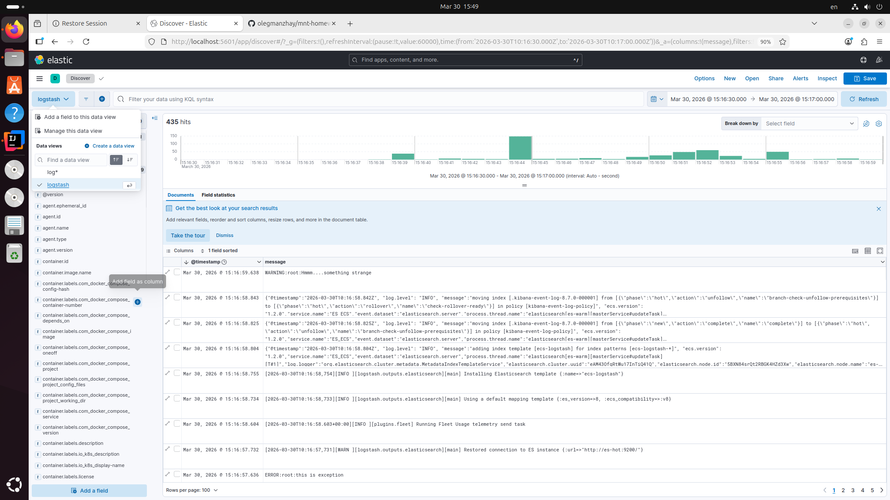

```azure
ubuntu@ubuntu:~/IdeaProjects/mnt-homeworks$ docker ps
CONTAINER ID   IMAGE                    COMMAND                  CREATED          STATUS          PORTS                                                                                                NAMES
636133e921fa   elastic/filebeat:8.7.0   "/usr/bin/tini -- /u…"   32 minutes ago   Up 32 minutes                                                                                                        filebeat
06654cd05ddb   logstash:8.7.0           "/usr/local/bin/dock…"   32 minutes ago   Up 32 minutes   0.0.0.0:5044->5044/tcp, [::]:5044->5044/tcp, 0.0.0.0:5046->5046/tcp, [::]:5046->5046/tcp, 9600/tcp   logstash
f4189ad0121b   kibana:8.7.0             "/bin/tini -- /usr/l…"   32 minutes ago   Up 32 minutes   0.0.0.0:5601->5601/tcp, [::]:5601->5601/tcp                                                          kibana
a057e4cc7b15   elasticsearch:8.7.0      "/bin/tini -- /usr/l…"   32 minutes ago   Up 32 minutes   0.0.0.0:9200->9200/tcp, [::]:9200->9200/tcp, 9300/tcp                                                es-hot
70fa1ef962c5   python:3.9-alpine        "python3 /opt/run.py"    32 minutes ago   Up 32 minutes                                                                                                        some_app
cae129eff5b2   elasticsearch:8.7.0      "/bin/tini -- /usr/l…"   32 minutes ago   Up 32 minutes   9200/tcp, 9300/tcp       
```

